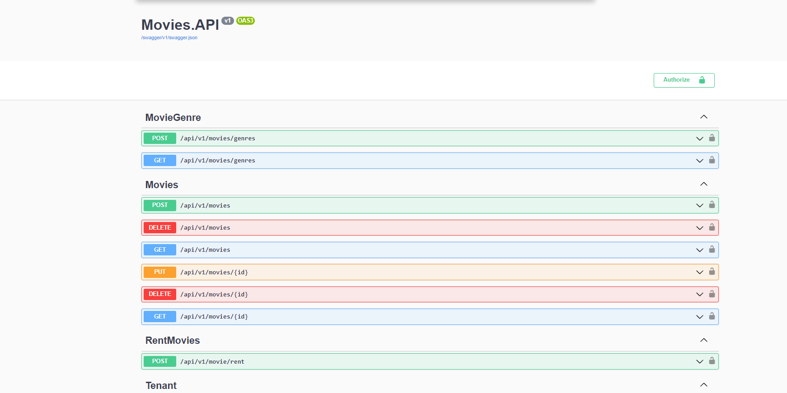
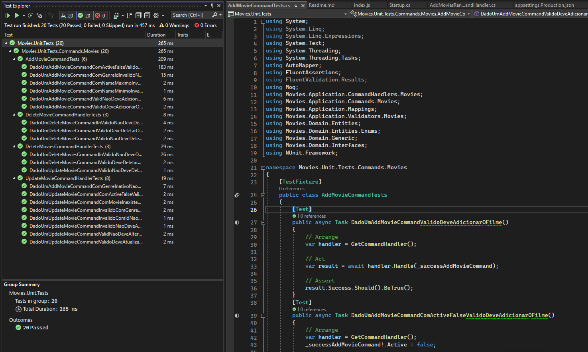

# Filmes

## Features:
- Listar os filmes cadastrados
- Cadastrar um novo filme
- Editar um filme
- Remover um filme individualmente
- Remover vários filmes de uma só vez
### Autenticação foi implementada no backend, no frontend não foi feita uma tela de login, a autenticação foi feita "hard-coded" no frontend para facilitar
### Email "userMaster@gmail.com" Password "1234" se o token desse usuario não estiver setado no Header das requisições vai ser retornado 401(Unauthorized)

## Rodando a Aplicação localmente
Para rodar a api localmente, o dotnet 5.0 e o SQL Server precisam estar instalados e seguir com os seguintes comandos:
1. `cd Movies.API`
2. `dotnet run`
### Se o docker estiver instalado é só rodar um docker-compose up na pasta do projeto da API que o SQlServer vai subir
Para rodar o frontend localmente, é preciso seguir com os seguintes comandos:
1. `cd moviesfrontend
2. `npm install`
3. `npm start`

No seu navegador, entre nos seguintes Link:
### Backend: https://localhost:5001/swagger/index.html
### Frontend: http://localhost:3000/

### Arquitetura e Organizacao

Para o desenvolvimento do sistema foi utilizada a arquitetura de camadas baseada no modelo Domain Driven Design da figura abaixo. 

Cada projeto representa uma camada. As responsabilidades de cada camada sao:

	- Apresentacao: Interface do usuario (Projeto moviesfrontend);
	- Servicos Distribuidos: disponibiliza endpoints para serem utilizados pela camada de apresentacao (Projeto Movies.API);
	- Aplicacao: gerencia os recursos da solucao (Projeto Movies.Application);
	- Dominio: contem os objetos e as regras de negocio (Projeto Movies.Domain);
	- Infraestrutura: servicos externos e camada de acesso a dados (Projeto Movies.Infra).

### Deploy	

### Backend: https://moviesapi20231119053312.azurewebsites.net
### Frontend: https://moviesfrontend-iota.vercel.app

### Eu coloquei a ConnectionString do banco de dados de produção no appsettings.Production.json propositalmente para facilitar testes, caso queira conectar...
